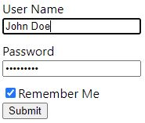

# Boost-Web Forms

An opinionated tiny (~3 kb) form generator for javascript objects.

It basically turns this object:

```javascript
let obj = {
    userName: "",
    password: "",
    rememberMe: true
}
```

without any configuration, into this:



## Installation

```shell
npm i boost-web-forms
```

## Getting Started

To generate a login form, 

1. Create your model:

```javascript
let forObj = {
    email: '',
    password: '',
    rememberMe: false
}
```

2. Then create a form configuration by calling the `createFormConfig` method:

```javascript
import {createFormConfig} from 'boost-web-forms'

const formConfig = createFormConfig(forObj)
```

3. Finally, render the form on the DOM:

**For vanilla javascript**:

```javascript
const formHtmlElt = renderForm(forObj, formConfig)
document.body.append(formHtmlElt)
```

**For Svelte**:
```jsx
<Form forObject={forObj} formConfig={formConfig} />
```

**For React**:
```jsx
<Form forObject={forObj} formConfig={formConfig} />
```

This will render an HTML form with 3 fields,

* Email field with label
* Password field with type password
* A checkbox with the label: 'Remember Me'

## Configuring the Form

While the library includes good set of defaults, the form can be configured as needed.

For example, to make the form read-only and hide all labels, use:

```javascript
const formConfig = createFormConfig(forObj, {
    readonly: true,
    hideLabel: true
})
```

All available form configuration

| Option | Type | Default Value |
| --- | ----------- | ---------|
| `readonly` | boolean | false |
| `hideLabel` | boolean | false |
| `columns` | number | 1 |

## Configuring Fields

Every individual field can be configured in the form configuration using `fieldsConfig` key.
For example, to make the password field readonly:

```javascript
const formConfig = createFormConfig(forObj, {
    fieldsConfig: {
        password: {readonly: true}
    }
})
```

Another example would be to set the type of fields. 
For example, to set types for 'confirm password' and comment fields as:

```javascript
const forObj = {
    name: '',
    password: '',
    confirmPassword: '',
    comment: ''
}

const formConfig = createFormConfig(forObj, {
    fieldsConfig: {
        confirmPassword: {type: 'password'},
        comment: {type: 'textarea', label: 'Any Comments?'}
    }
})
```

All available field configuration

| Option | Description | Type | Default Value |
| --- | ----------- | ---------| ---- |
| `readonly` | Makes the field not editable | boolean | false |
| `showLabel` | Whether to generate label for the input | boolean | true |
| `icon` | Specify an icon for the field | string | ''
| `type` | Specify the type of value for the field | string | Automatically guessed
| `required` | Whether empty values are allowed | boolean | false
| `helpText` | Specify a description for the input | string | ''
| `label` | Text shown as the label of the input field | string | Automatically generated
| `placeholder` | Specify the text shown as a placeholder for the input field | string | ''
| `validate` | Specify validations for the field | - | Refer section 'Validation' below
| `scale` | Specify whether to show big or small input controls. | number | 1
| `id` | HTML ID of the input | string | Automatically guessed
| `colSpan` | Column span, if the form has more than 1 column | number | 1

Supported field types are:

* text 
* email 
* password 
* file 
* select 
* autocomplete 
* checkbox 
* number 
* date 
* datetime 
* time 
* textarea 
* markdown 
* reCaptcha 
* radio
* html

## Validation

Validation specs can be added to either on the form level or individual fields.
There are good set of validation functions already included in this library:

```javascript
import {notEmpty, validName} from 'boost-web-forms'

const formConfig = createFormConfig(forObject, {
    fieldsConfig: {
        name: {validate: [notEmpty, validName]}
    }
})
```

The `validate` field would accept:

* A custom method that returns an error message
* A built-in validate method (like `notEmpty`)
* A built-in validator generator (like `getMinLenValidator(4)`)
* An array of any of the above
* An async server side validator, like:
  
```
async (val) => { 
    return await (await fetch('http://server.com/username-taken/' + val)).json() 
})
```

Built-in validation methods:

| Method | Description | For input types | Usage |
| --- | ----------- | ---------| ---- |
| `notEmpty` | Checks if input is empty, null or whitespace | any | `notEmpty` |
| `validName` | Check if string is a valid personal name | string | `validName` |
| `getMinLenValidator` | Returns a validator that checks minimum string length | string | `getMinLenValidator(4)` |
| `getStrongPasswordValidator` | Returns a validator that checks for a password's strength | string | `getStrongPasswordValidator({minLength: 6, specialChars: true})`
| `fileTypeValidator` | Returns a file type validator | file | `fileTypeValidator('image/png')`
| `imgTypeFile` | Checks if an uploaded file is a valid image | file | `imgFileType`
| `maxFileSize` | Checks if an uploaded file size exceeds the given size | file | `maxFileSize`

Using custom validation functions is also easy. 
Just return an error message if it should fail, empty string otherwise.

```javascript
const formConfig = createFormConfig(forObject, {
    fieldsConfig: {
        age: {validate: val => (val < 18 ? 'Age must be 18 or above' : '')}
    }
})
```

Validations can also be done on the form level as:

```javascript
const formConfig = createFormConfig(forObject, {
    validate: val => (val.password != val.confirmPassword ? 'Passwords do not match.' : '')
})
```

To run validations manually:

```javascript
import {validateForm} from 'boost-web-form'

let validationResult = validateForm(forObj, formConfig)
```

Would give a validation result such as:

```javascript
validationResult = {
    hasErrors: true,
    errorMessage: '', // Form level validation errors, if any
    fields: {
        email: {hasError: true, errorMessage: 'Please, fill in this field.'},
        password: {hasError: true, errorMessage: 'Password is too weak.'},
        name: {hasError: false, errorMessage: ''}
    }
}
```