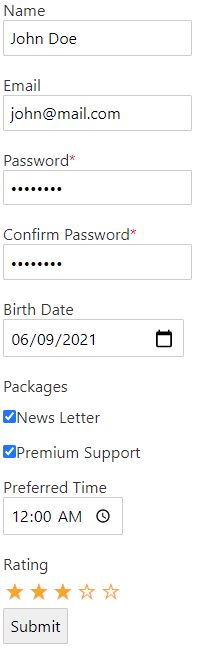
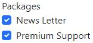
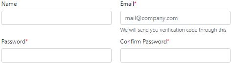

# Boost-Web Forms

### What is it?
An opinionated, small form generator library for javascript objects.

It basically turns this object:

```javascript
let obj = {
    userName: "",
    password: "",
    rememberMe: true
}
```

without any configuration or schema, into this:


### Why boost-web-forms?

* Zero dependencies
* Works with vanilla JS
* Built-in react and svelte support
* No schema or configuration needed to generate forms (although supported)
* Built-in plugins for popular UI kits (bootstrap, bulma, etc.)
* API is as close to the DOM API as possible

## Installation

```shell
npm i boost-web-forms
```

or 

```shell
yarn add boost-web-forms
```

## Quick Start

To generate the above login form, 

1. Create your model:

```javascript
let forObj = {
    email: '',
    password: '',
    rememberMe: false
}
```

2. Render the form on the DOM:

**For vanilla javascript**:

```javascript
import {renderForm} from 'boost-web-forms'

const formHtmlElt = renderForm(forObj)
document.body.append(formHtmlElt)
```

**For React**:
```jsx
import {GetReactForm} from 'boost-web-forms'

const Form = GetReactForm(React.createElement)
<Form forObject={forObj} />
```

**For Svelte**:
```jsx
import {SvelteForm as Form} from 'boost-web-forms'

<Form forObject={forObj} />
```

This will automatically render the following HTML:

```html
<form>
  <div>
    <label for="userName">User Name</label> 
    <input name="userName" colspan="1" id="userName" type="name" value="">
  </div>
  <div>
    <label for="password">Password<span style="color: red;">*</span></label> 
    <input name="password" colspan="1" id="password" required="" type="password" value="">
  </div>
  <div>
    <input type="checkbox" name="rememberMe" colspan="1" id="rememberMe" checked=""> 
    <label for="rememberMe" style="display: inline-block;">Remember Me</label>
  </div>
  <div> 
    <input type="submit" name="$$submit" colspan="1" id="$$submit">
  </div>
</form>
```

For popular UI kits [see](#plugins).

## Quick Start 2

Let's generate form for a more complicated registration model:

```javascript
let forObj = {
    name: '',
    email: '',
    password: '',
    confirmPassword: '',
    birthDate: '',
    packages: ['newsLetter', 'premiumSupport'],
    preferredTime: '00:00:00'
}
```

Will automatically render:



You can see that:

* Field types were auto guessed from field names
* Humanizes label texts (`confirmPassword` becomes `Confirm Password`)
* Generates native `<input>` tags
* Sets `required` fields for password inputs

## Configuring the Form

While the library includes good set of defaults, the form can be configured as needed.

All valid HTML `<form>` tag [attributes](https://developer.mozilla.org/en-US/docs/Web/HTML/Element/form) can be used.
For example:

```javascript
const options = {
    method: 'POST',
    enctype: 'multipart/form-data',
    class: 'form columns',
    onsubmit: e => {alert('Submitting...')}
}
```

Then pass the configuration to any of the renderers:

```jsx
// Vanilla
document.body.append(
    renderForm(forObj, options)
)

// React
<Form forObject={forObj} method="POST" 
    enctype="multipart/form-data" onsubmit={e => alert('Submitting...')} />

// Svelte
<Form forObject={forObj} options={options} />
```

All available form configuration options

| Option | Type | Description | Default Value |
| --- | ----------- | --- | ---------|
| `readonly` | boolean | Makes all fields readonly | false |
| `hideLabels` | boolean | Hides labels of all fields | false |
| `excludeSubmitButton` | boolean | Doesn't include a submit button automatically | false |
| `scale` | number | Zoom factor for fields. Shows large or small fields | 1 |
| All valid html `<form>` [attributes](https://developer.mozilla.org/en-US/docs/Web/HTML/Element/form) | - | Will show up in the `<form>` tag. These include `id`, `action`, `style`, `class`, `onsubmit`, etc. | - |

## Configuring Fields

Every individual field can be configured in the form configuration using `fieldsConfig` key.
For example, to make the password field readonly:

```javascript
const options = {
    fieldsConfig: {
        password: {readonly: true}
    }
}

// React
<Form forObject={forObj} fieldsConfig={{
        password: {readonly: true}
    }} />
```

Note: All valid HTML input [attributes](https://developer.mozilla.org/en-US/docs/Web/HTML/Element/input) can be used here.

All available field configuration

| Option | Description | Type | Default Value |
| --- | ----------- | ---------| ---- |
| `readonly` | Makes the field not editable | boolean | false |
| `label` | Text that's shown in the label | string | Automatically guessed |
| `hideLabel` | Whether to generate label for the input | boolean | false |
| `type` | Specify the type of value for the field | string | Automatically guessed
| `helpText` | Specify a description for the input | string | ''
| `validate` | Specify validations for the field | - | Refer section: [Validation](#validation)
| `scale` | Specify whether to show big or small input controls. | number | 1
| `colSpan` | Column span, if the form has more than 1 column | number | 1
| `maxlength` | Maximum length of text allowed | string | '' |
| `multiple` | If multiple values are allowed (only for `select` and `radio` types) | boolean | false |
| `choices` | Sets of choices the user can pick from (only for `select` and `radio` types) | `string[]` or `Object` with key-value pairs | null |
| `readonly` | Whether the field is read-only | boolean | false |
| All valid html `<input>` [attributes](https://developer.mozilla.org/en-US/docs/Web/HTML/Element/input) | - | Will show up in the `<input>` tag. These include `id`, `placeholder`, `style`, `class`, `onchange`, etc. | - |


### Field Types

The type of a field can be specified using `type` attribute in the field config.
All `<input>` tag's [type attribute values](https://developer.mozilla.org/en-US/docs/Web/HTML/Element/input#input_types) are supported.
For example, to set types for 'confirm password' and comment fields:

```javascript
const forObj = {
    name: '',
    password: '',
    confirmPassword: '',
    comment: ''
}

const options = {
    fieldsConfig: {
        confirmPassword: {type: 'password'},
        comment: {type: 'textarea', label: 'Any Comments?'}
    }
}

// React
<Form forObject={forObj} fieldsConfig={{
    confirmPassword: {type: 'password'},
    comment: {type: 'textarea', label: 'Any Comments?'}
}} />
```

Supported field types are:

```typescript
'text' | 'email' | 'password' | 'file' | 'files' | 'select' | 'autocomplete' |
'checkbox' | 'toggle' | 'number' | 'date' | 'time' | 'textarea' | 'markdown' | 'reCaptcha' |
'radio' | 'html' | 'color' | 'datetime-local' | 'month' | 'year' | 'range' | 'reset' | 'tel' | 'url' | 'week' |
'multiselect-checkbox' | 'composite' | 'version' | 'avatar' | 'city' | 'country' | 'ipv4' | 'ipv6' | 'guid' |
'isbn' | 'location' | 'language' | 'money' | 'timezone' | 'title' | 'gallery' | 'submit'
```

Note: Not all the above types can be rendered right now. It is a work in progress.

### Select types

To use select (drop-down) field type use `choices` field to specify options:

```jsx
let options = {
    fieldsConfig: {
        userType: {
            type: 'select',
            placeholder: '-- Select User Type --',
            choices: ['Admin', 'Guest', 'Member']
        }
    }
}
```

Will render a select input like:

```html
<select id="userType" name="userType">
  <option value="">-- Select User Type --</option>
  <option value="Admin">Admin</option>
  <option value="Guest">Guest</option>
  <option value="Member">Member</option>
</select>
```

To use different values and labels for the options, use an object with key-value pairs:

```javascript
choices: {AD: 'Admin', GU: 'Guest', ME: 'Member'}
```

Will render a select input like:

```html
<option value="AD">Admin</option>
<option value="GU">Guest</option>
<option value="ME">Member</option>
```

### Radio types

To use radio (choices) field type use:

```jsx
let options = {
    fieldsConfig: {
        userType: {
            type: 'radio',
            choices: ['Admin', 'Guest', 'Member']
        }
    }
}
```

Will render radio inputs like:

```html
<label>
  <input name="userType" type="radio" value="Admin"> Admin
</label>
<label>
  <input name="userType" type="radio" value="Guest"> Guest
</label>
<label>
  <input name="userType" type="radio" value="Member"> Member
</label>
```

To use different values and labels for the options, use an object with key-value pairs:

```javascript
choices: {AD: 'Admin', GU: 'Guest', ME: 'Member'}
```

### Multiple choices (select and radio types)

To enable multiple values for both `select` and `radio` types, just set `multiple` to true

```jsx
let options = {
    fieldsConfig: {
        packages: {
            type: 'radio',
            choices: ['Newsletter', 'PremiumSupport'],
            multiple: true
        }
    }
}
```

This will change the field type to set of checkboxes as:



## Validation

Validation specs can be added to either on the form level or individual fields.
There are good set of validation functions already included in this library:

```javascript
import {notEmpty, validName} from 'boost-web-forms'

const options = {
    fieldsConfig: {
        name: {validate: [notEmpty, validName]}
    }
}
```

The `validate` field would accept:

* A custom method that returns an error message
* A built-in validate method (like `notEmpty`)
* A built-in validator generator (like `getMinLenValidator(4)`)
* An array of, any of the above
* An async server side validator, like:
  
```javascript
async (val) => {
    return 'true' == await (await fetch('http://server.com/username-taken/' + val)).json()
        ? 'User name already taken'
        : ''
}
```

Then this validation result can be rendered:

```jsx
import {validateForm} from 'boost-web-forms'

// Vanilla JS
let validationResult = validateForm(forObj)
document.body.append(
    renderForm(forObj, null, null, validationResult)
)

// React
let validationResult = validateForm(forObj)
<Form forObject={forObj} validationResult={validationResult} />

// Svelte
let validationResult = validateForm(forObj)
<Form forObject={forObj} validationResult={validationResult} />
```

Built-in validation methods:

| Method | Description | For input types | Usage |
| --- | ----------- | ---------| ---- |
| `notEmpty` | Checks if input is empty, null or whitespace | any | `notEmpty` |
| `validName` | Check if string is a valid personal name | string | `validName` |
| `getMinLenValidator` | Returns a validator that checks minimum string length | string | `getMinLenValidator(4)` |
| `getStrongPasswordValidator` | Returns a validator that checks for a password's strength | string | `getStrongPasswordValidator({minLength: 6, specialChars: true})`
| `fileTypeValidator` | Returns a file type validator | file | `fileTypeValidator('image/png')`
| `imgTypeFile` | Checks if an uploaded file is a valid image | file | `imgFileType`
| `maxFileSize` | Checks if an uploaded file size exceeds the given size | file | `maxFileSize`

Using custom validation functions is also easy. 
Just return an error message if it should fail, empty string otherwise.

```javascript
const options = {
    fieldsConfig: {
        age: {validate: val => (val < 18 ? 'Age must be 18 or above' : '')}
    }
}
```

Validations can also be done on the form level as:

```javascript
const options = {
    validate: val => (val.password != val.confirmPassword ? 'Passwords do not match.' : '')
}
```

To run validations manually:

```javascript
import {validateForm} from 'boost-web-form'

let validationResult = await validateForm(forObj, formConfig)
```

Would give a validation result such as:

```javascript
validationResult = {
    hasErrors: true,
    message: '', // Form level validation errors, if any
    fields: {
        email: {hasError: true, message: 'Please, fill in this field.'},
        password: {hasError: true, message: 'Password is too weak.'},
        name: {hasError: false, message: ''}
    }
}
```

## Plugins

Plugins for popular UI kits are already included.
You may have to include the required CSS/JS assets in your project first.
Included plugins are:

* Bootstrap (versions 3, 4 and 5) (visit [https://getbootstrap.com](https://getbootstrap.com))
* Bulma (visit [https://bulma.io](https://bulma.io))

To use a specific plugin, pass it over in the `renderOptions` parameter

```jsx
import {Bootstrap5} from 'boost-web-forms'

// Vanilla JS
renderForm(forObj, options, formValidationResult, Bootstrap5({columns: 2}))

// React
<Form forObject={forObj} renderOptions={Bootstrap5({columns: 2})} />

// Svelte
<Form forObject={forObj} renderOptions={Bootstrap5({columns: 2})} />
```

Will render something like:



All available plugins:

| Plugin | Description | Import |
| --- | ----------- | ---------| 
| `Bootstrap5` | Bootstrap v5 | `import {Bootstrap5} from 'boost-web-forms'` |
| `Bootstrap4` | Bootstrap v4 | `import {Bootstrap4} from 'boost-web-forms'` |
| `Bootstrap3` | Bootstrap v3 | `import {Bootstrap3} from 'boost-web-forms'` |
| `Bulma` | Bulma | `import {Bulma} from 'boost-web-forms'` |

Available plugin options:

| Option | Description | Type | Default Value |
| --- | ----------- | ---------| ---- |
| `columns` | Number of columns to layout the form into | number | 1 |
| `isInline` | Whether all fields are laid out horizontally | boolean | false |
| `isHorizontal` | Whether to arrange label and input pairs side-by-side | boolean | false |

## Custom Plugins and Renderers

TBD
